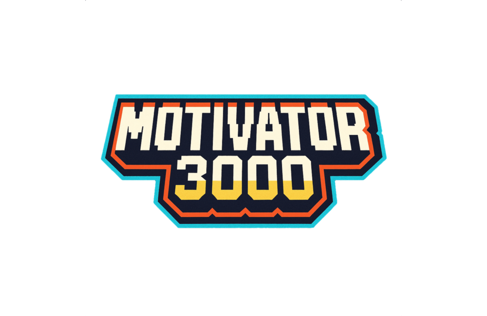

# Motivator3000

*L’assistant IA local et libre pour aider les lycéens à briller dans l’écosystème des stages professionnels.*

Motivator3000 est un projet du *Cormont Computer Club*. 

# Introduction au projet

## Pourquoi l’usage "générique" de l’IA par les lycéens ne suffit pas
Avec la généralisation des outils d’intelligence artificielle accessibles en ligne, de nombreux lycéens ont commencé à utiliser des modèles comme ChatGPT, Gemini ou d’autres assistants IA pour générer leurs CV ou leurs lettres de motivation. Si cette démarche est compréhensible et peut sembler rassurante, elle pose plusieurs limites majeures.

### Des lettres génériques et interchangeables
Les modèles d’IA généralistes, même performants, n’ont aucune connaissance réelle du parcours scolaire ou professionnel spécifique des lycéens, en particulier ceux de la voie professionnelle.
Résultat : les lettres générées sont souvent très semblables les unes aux autres, quel que soit :
- le métier visé (électricien, technicien réseau, agent de maintenance...),
- la formation suivie (MELEC, CIEL, Transition numérique...),
- l’annonce à laquelle l’élève répond.

On retrouve systématiquement les mêmes formulations creuses, comme :
'"Je suis très motivé pour rejoindre votre entreprise et acquérir de l'expérience."'
ou encore :
'"Votre structure correspond parfaitement à mes aspirations professionnelles."'
Ces phrases, bien que polies, n’ont aucune valeur différenciante et ne permettent ni de refléter la réalité du parcours de l’élève, ni de réellement convaincre un recruteur.

### Un contenu répétitif et sans personnalité
La majorité des modèles produisent du texte en s’appuyant sur des probabilités de langage et des formulations génériques. Lorsqu’ils ne sont pas alimentés par des informations contextuelles précises, ils finissent par générer toujours les mêmes types de documents, qui manquent :
- de spécificité (compétences réellement acquises),
- de cohérence métier (liens entre formation et mission de stage),
- de personnalité (langage, centres d’intérêt, projet professionnel).

Pire encore : dans un même lycée, plusieurs élèves utilisant les mêmes outils peuvent se retrouver avec des lettres presque identiques, ce qui peut desservir leur crédibilité.

## Motivator 3000 : une réponse adaptée, locale et intelligente
La plateforme Motivator 3000 a été conçue précisément pour répondre à ces limites, en proposant un assistant IA :
contextualisé : il s’appuie sur les référentiels officiels des formations suivies par les élèves,
personnalisé : il tient compte du profil de chaque utilisateur et de l’annonce à laquelle il répond,
local : tout fonctionne sans connexion internet, sans cloud, dans le respect total du RGPD,
libre : le projet est open source, modifiable, installable dans n’importe quel établissement.
En combinant la puissance de l’intelligence artificielle avec une architecture RAG (Retrieval-Augmented Generation) et un ancrage fort dans les parcours des lycéens, Motivator 3000 permet enfin de produire des lettres et des CV crédibles, valorisants et réellement adaptés aux ambitions de chaque élève.

C’est une solution concrète pour accompagner les jeunes dans leurs premières démarches professionnelles — sans copier-coller impersonnel, sans cloud, et sans renoncer à l’exigence de qualité.

# Pourquoi ce nom ?
Motivator3000 est un clin d’œil assumé à l’esthétique rétro-futuriste des films de science-fiction de série B et des jeux vidéo vintage des années 80-90.
Ce nom a été choisi pour plusieurs raisons stratégiques :
- Le rétro-gaming et l’univers néo-vintage sont très populaires chez les jeunes générations, en particulier chez les lycéens intéressés par les filières techniques ou numériques. Cela crée un lien culturel immédiat avec l’univers visuel et affectif des publics cibles.
- C’est aussi un clin d’œil ludique aux générations plus âgées, encadrants pédagogiques et développeurs, qui y verront une référence ironique aux titres comme RoboCop, Mototron, ou Megatron 3000.
- Ce côté kitsch et second degré a un fort pouvoir d’attractivité dans l’univers open source, souvent sensible à la culture geek, aux blagues techniques et aux projets qui assument leur identité avec humour tout en servant une cause utile.

En résumé, Motivator3000, c’est un nom qui :
- donne envie de contribuer à un outil libre sympa et utile,
- crée de la curiosité et du capital sympathie,
- affirme une identité décomplexée et accessible, tout en assumant la puissance technique de l’IA embarquée.
 
# Objectif du projet
Développer un assistant logiciel local et libre, capable d’aider les lycéens de la voie professionnelle à :
- rédiger des CV valorisants et bien structurés,
- produire des lettres de motivation personnalisées à partir d’annonces de stage ou d’alternance,
- mettre en avant les compétences issues de leurs référentiels de formation.
 
## Un assistant boosté à l’IA (mais en local)
Le cœur de Motivator3000 repose sur une IA embarquée, renforcée par une architecture RAG (Retrieval-Augmented Generation).

Le système permet à l’IA de générer des textes contextualisés à partir :
- des référentiels officiels des filières professionnelles,
- des annonces fournies par les élèves (PDF, copier/coller, etc.),
- de modèles de CV/lettres adaptés aux standards professionnels.
 
## RGPD et souveraineté numérique : priorité absolue
Motivator3000 fonctionne 100% en local, sans traitement distant, afin de garantir :
- le respect du RGPD, en particulier pour les élèves mineurs (moins de 16 ans),
- la maîtrise complète des données, sans cloud, sans inscription, sans tracking,
- la possibilité de déploiement même sans connexion internet (réseau local ou poste unique).
 
## Open Source et licence libre
Tous les développements sont publiés sous AGPL v3, pour permettre :
- aux autres lycées et structures de déployer librement l’outil,
- aux enseignants, responsables de BDE ou DDFPT et développeurs de l’adapter et l’enrichir,
- à la communauté de partager les améliorations en toute liberté.

# Motivator3000, le point sur le projet :
Ce qui a été fait pour l’instant, ou est en cours de réalisation
 
## Exploration des modèles IA open source adaptés à un usage local
Objectif : identifier des modèles de langage suffisamment puissants pour générer des contenus personnalisés (CV, lettres de motivation), mais légers et respectueux des contraintes locales (pas de cloud, pas de dépendance à des API commerciales).

Modèles testés :
- Gemma (gemma-3-27b et gemma-3-12b)
- Mistral (mistral-small-3.2)
- LLaMA (llama-3.3-70b)
- DeepSeek (deepseek-r1-0528-qwen3-8b)
- Qwen (qwen3-8b)

Critères évalués :
- Qualité de génération (fluidité, structure)
- Capacité à tourner en local (sur CPU ou GPU)
- Volume mémoire et performance sur machine (très) modeste
 
Constat :
 Malgré des performances linguistiques solides, les réponses produites par les modèles testés sont trop déterministes et génériques.
Les lettres générées manquent de variabilité, d’originalité et surtout de prise en compte réelle du contexte scolaire et professionnel des lycéens. On observe que, quelle que soit l’annonce ou le profil fourni, les lettres finissent par se ressembler fortement, avec des tournures stéréotypées et un contenu creux. Toutefois, vu les perfromances et les résultats obtenus, le choix pour l'instant porte du Gemma-2-9b de google.

Globalement, ce comportement souligne les limites d’un modèle généraliste non enrichi, incapable d’ajuster sa réponse en fonction de référentiels métier ou de parcours spécifiques.


Cela justifie pleinement l’adoption d’une architecture RAG (Retrieval-Augmented Generation), permettant de connecter l’IA à une base documentaire métier, adaptée aux formations professionnelles suivies par les élèves.
 
## Conception d’un système de prompt structuré
Objectif : formuler des instructions claires et précises pour guider les modèles dans leurs productions (system prompt).
Actions menées :
- Définition de plusieurs types de prompts : création de CV, lettre pour une alternance, lettre pour un stage, mise en valeur d’un projet scolaire, etc.
- Création de gabarits de prompt intégrant les données contextuelles (niveau d’étude, spécialité, type de poste ciblé, référentiel).
- Tests manuels pour évaluer la réactivité des modèles à ces instructions.

Résultat : Les prompts bien structurés améliorent la pertinence, mais ne suffisent pas en l’absence de connaissance métier spécifique au contexte du lycée professionnel. D’où la nécessité d’implémenter un système RAG avec accès aux référentiels.

# Licence et propriété intellectuelle
Motivator3000 - l'assistant numérique pour une pfmp réussie

Copyright (C) 2025 Lycée Louis de Cormontaigne - Matthieu Farcot

Ce programme est un logiciel libre : vous pouvez le redistribuer et/ou le modifier selon les termes de la Licence Publique Générale Affero GNU telle que publiée par la Free Software Foundation, soit la version 3 de la licence, soit (à votre choix) toute version ultérieure (voir le document licence.txt à la racine du projet).

Ce programme est distribué dans l’espoir qu’il sera utile, mais SANS AUCUNE GARANTIE ; sans même la garantie implicite de COMMERCIALISATION ou D’ADÉQUATION À UN BUT PARTICULIER.   Consultez la Licence Publique Générale Affero GNU pour plus de détails.

